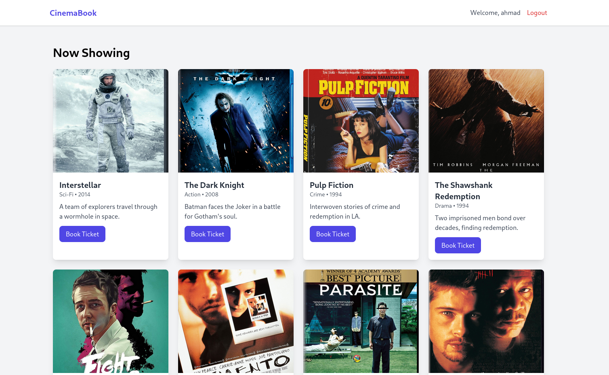
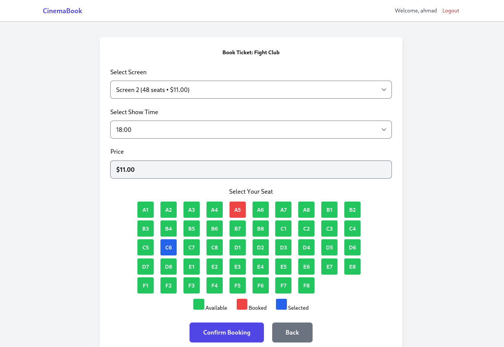

<div align="center">

# Cinema Booking System

**A modern movie ticket booking system with real-time seat selection, admin panel, and HD posters.**


</div>

---

## Screenshots

<div align="center">

### Movie List with HD Posters


### Real-Time Seat Selection


### Admin Dashboard


</div>

---

## Features

- Movie browsing with **HD posters**
- **Real-time seat map**: Green = Available, Blue = Selected, Red = Booked
- **Dynamic pricing** per screen
- **Admin panel**: View, edit, delete bookings
- **Secure login** (Customer + Admin)
- **Responsive design** (Mobile & Desktop)

---

## Tech Stack

- **Laravel 12** + Eloquent ORM
- **Tailwind CSS** + Vite
- **MySQL**
- **Laravel Breeze** (Auth)

---

## Quick Setup

```bash
git clone https://github.com/SiratNemati/movie-booking-management-system.git
cd movie-booking-management-system
composer install
cp .env.example .env
php artisan key:generate
php artisan migrate:fresh --seed
php artisan storage:link
npm install && npm run build
php artisan serve
```
---

## License
MIT License © Sirat Nemati

